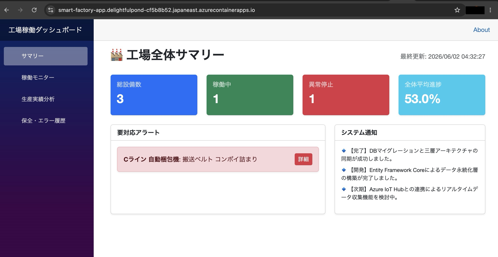
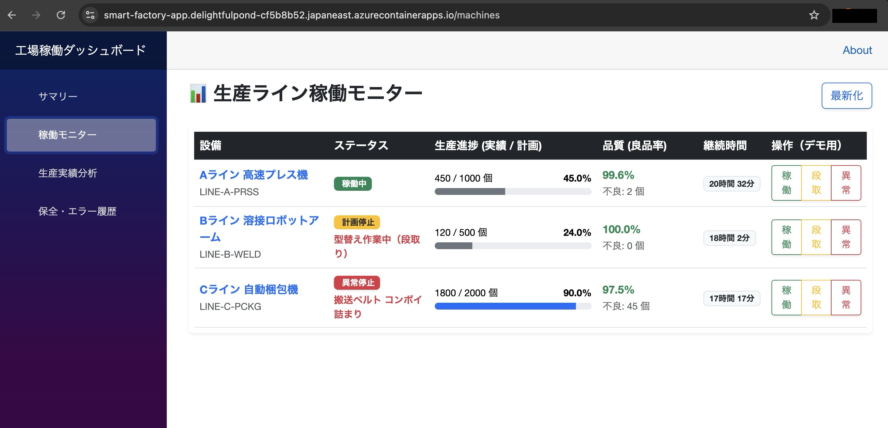
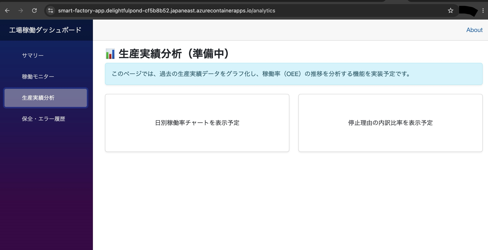
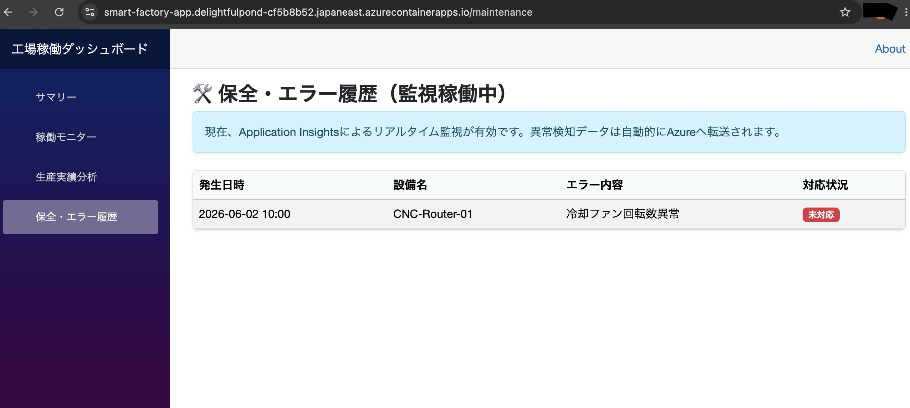
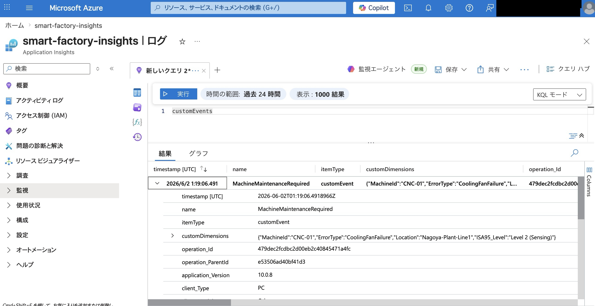

# 🏭 SmartFactorySystem - 製造現場DXのための稼働監視プラットフォーム

## 📝 プロジェクト概要
本システムは、製造現場における「設備稼働の不透明さ」を解消し、**OEE（設備総合効率）の向上**を支援するためのダッシュボードシステムです。 
単なる状態表示に留まらず、停止理由の分析や生産進捗のリアルタイム可視化を三層アーキテクチャで実装しています。

---
## 💡 背景・ユースケース（User Stories）

本システムは、製造現場の保全担当者が抱える「現場のブラックボックス化」という課題を解決するために設計されました。

### 🎯 想定ターゲット（ペルソナ）
- 工場の保全・工機部門のマネージャー
- 現場の稼働率をリアルタイムに把握し、改善アクションに繋げたいDX担当者

### 🛠 具体的な活用シーン
1. **予知保全の足がかり**: 
   センサーから上がってきた微細なエラーを「保全画面」で即座にキャッチ。致命的な故障によるライン停止を防ぎ、計画的なメンテナンスを可能にします。
2. **稼働率の可視化と改善**: 
   ダッシュボードで進捗遅延や停止理由（コンボイ詰まり等）を特定。「なんとなく効率が悪い」という感覚を数値化し、ボトルネックの解消を支援します。
3. **リモート監視による管理コスト削減**: 
   Azure Application Insightsを活用した垂直統合型監視により、事務所や外出先からでも現場の健全性をリアルタイムに把握できます。

---
## 📈 ビジネス課題の解決（Business Value & ROI）

上記のユースケースに対し、国際標準（ISA-95）の思想とモダンなクラウドアーキテクチャ（Azure Container Apps）を掛け合わせることで、製造業における3つのコア・ビジネス課題を解決します。

### 1. 計画外停止（ダウンタイム）の極小化による「利益保護」
* **背景にある課題:** 製造業において、ラインが1時間停止（ダウンタイム）した際の損失は数百万円〜数千万円にのぼります。従来の「壊れてから直す事後保全」では、この機会損失を回避できません。
* **技術的アプローチ:** ISA-95 Level 2（制御・監視層）のアラートを、Application Insightsを通じてクラウドへリアルタイム転送し構造化ログとしてインデックス化。
* **ビジネス効果:** 致命的なクラッシュに至る前に予知保全（部品の事前手配や計画停止）が可能となり、**生産ラインの稼働率（OEE）を直接的に向上・維持**させます。

### 2. データドリブンな意思決定による「組織の透明化とPDCA高速化」
* **背景にある課題:** 現場の「熟練工の勘」や「曖昧な現場日報」に依存した管理では、本当のボトルネック（生産遅延の真因）の把握や、経営層への迅速な状況報告が困難でした。
* **技術的アプローチ:** 現場のパルスデータ（停止時間・詳細な停止理由）をフロントエンド（Blazor）の「工場全体サマリー」へ自動集計し、ダッシュボード化。
* **ビジネス効果:** 経営層から現場のオペレーターまでが**同一の客観的エビデンス（数値）をベースに共通言語で会話できる環境**を構築し、現場改善アクション（PDCA）のサイクルを劇的に高速化します。

### 3. スモールスタートによる「DX投資リスクの低減とTCO削減」
* **背景にある課題:** 従来の工場監視システム（SCADA/MES）や大規模パッケージの導入には、数千万円規模の初期投資（CAPEX）と膨大な維持固定費（OPEX）が必要であり、投資対効果（ROI）が見えにくいリスクがありました。
* **技術的アプローチ:** C#（Blazor）による軽量な3層アーキテクチャと、Azure Container Apps（ACA）の「0スケール（従量課金）」特性をフル活用。
* **ビジネス効果:** リクエストがない時間帯のインフラコストを完全にシャットアウトし、**「最小限のコストで素早く始めて、成果を見ながら柔軟にマイクロサービス拡張する」アジャイルなDX投資**を可能にします（総所有コスト：TCOの最適化）。
---

## 🏗 設計思想：なぜ「三層アーキテクチャ」なのか
大規模開発を想定し、「関心の分離」と「テスト容易性」を最大化するために採用しました。

### Presentation層 (Blazor Web App)
* **役割:** UI/UXの提供。
* **意図:** ロジックを持たせず、表示とユーザー入力の受け付けに特化。将来的にWebからモバイルアプリへ移行する際も、他の層を一切汚さずに差し替え可能です。

### Application層 (Business Logic)
* **役割:** 業務ルールの定義。
* **意図:** データベースや画面の仕様に依存しない「純粋なドメインロジック（異常検知時のログ出力、進捗率計算など）」を保持します。

### Infrastructure層 (Data Access)
* **役割:** データの永続化。
* **意図:** Entity Framework Coreを採用。現在はSQLiteですが、依存関係を抽象化しているため、設定一つでSQL ServerやAzure SQL Databaseへ切り替え可能な設計にしています。

---

## 🚀 デプロイ環境（デモURL）

本アプリケーションは Azure Container Apps (ACA) 上に構築・公開されています。

* **アプリケーションURL:** [https://smart-factory-app.delightfulpond-cf5b8b52.japaneast.azurecontainerapps.io](https://smart-factory-app.delightfulpond-cf5b8b52.japaneast.azurecontainerapps.io)
> [!NOTE]
> 💡 **閲覧について:**  
> 現在はセキュリティ保護のため一般アクセスを遮断しています。実際の稼働画面やAzureでのデータ受信ログについては、以下の【稼働エビデンス（スクリーンショット）】、または [TROUBLESHOOTING.md](./TROUBLESHOOTING.md) をご参照ください。

### 📸 稼働エビデンス（スクリーンショット）

現在はインフラ保護（IP制限）のため外部アクセスを遮断していますが、Azure Container Apps 上でシステム全体が正常に稼働しているエビデンスを以下に公開します。

#### ① 工場全体サマリー（ダッシュボード）
アプリケーションのトップ画面です。総設備数、稼働状況、異常停止中のアラート件数や全体進捗率をリアルタイムに集計・可視化します。


#### ② 生産ライン稼働モニター
各ライン（A〜Cライン）の設備ステータス、生産進捗（実績／計画）、良品率、継続稼働時間を一覧表示する画面です。デモ操作用のボタンを配し、ステータスの模擬変更が可能です。


#### ③ 生産実績分析（次期拡張スペース）
過去の生産実績データから稼働率（OEE）の推移や停止理由の内訳比率をチャート分析するためのフロントエンド基盤です。


#### ④ 保全・エラー履歴画面（Azureリアルタイム監視稼働中）
Application Insights との連携が有効化されている運用画面です。この画面のロードやインシデント発生をトリガーとして、テレメトリデータが即座にAzureへパケット送信されます。


#### ⑤ Azure Application Insights でのカスタムイベント受信ログ
上記の保全画面から送信されたカスタムイベント（`MachineMaintenanceRequired`）を、AzureポータルのLog Analytics上でKQLクエリ（`customEvents`）を用いて抽出した結果です。
C#コード側で付与したカスタムディメンション（`MachineId: CNC-01`、`ISA95_Level: Level 2 (Sensing)` 等）が一言一句狂わずにクラウド側へ到達し、構造化ログとしてインデックス化されていることを証明しています。


---
## 📚 開発・運用ドキュメント

プロジェクトの詳細な仕様やトラブルシューティングについては、以下のドキュメントを参照してください。

- [**プロジェクト詳細仕様 (DOCS.md)**](./DOCS.md)  
  アーキテクチャの詳細、クラス設計、データモデル、および各コンポーネントの責務について解説しています。
- [**トラブルシューティング & 実装記録 (TROUBLESHOOTING.md)**](./TROUBLESHOOTING.md)  
  Azure Container Apps へのデプロイ、IP 制限設定、Application Insights 導入時に直面した課題とその解決策（Tips）をまとめています。
- [**Azure アーキテクチャとインフラ構成 (ARCHITECTURE.md)**](./ARCHITECTURE.md)  
  ACR, Docker, Container Apps を用いたインフラ設計、IP 制限によるセキュリティ実装、監視基盤の全体像について解説しています。
---

## 🛠 セットアップガイド（開発環境の構築）
PCがクリーンな状態からでも、以下の手順で動作確認が可能です。

### 1. 必要なツールのインストール
* **.NET 10.0 SDK:** 本システムのランタイム及びコンパイラ。
* **VS Code:** 推奨エディタ。
    * 拡張機能: `C# Dev Kit`, `SQLite Viewer` (DB確認用)

### 2. ローカルDBの構築
本プロジェクトはSQLiteを使用しているため、外部DBサーバーの構築は不要です。

```bash
# EF Core ツールをインストール（未導入の場合）
dotnet tool install --global dotnet-ef

# データベースを生成
dotnet ef database update --project Infrastructure --startup-project Presentation
```

### 3. アプリケーションの実行
```bash
# アプリケーションの実行
dotnet run --project Presentation/SmartFactorySystem.Presentation.csproj
```

### 4. 使用技術
 - Backend: C#, .NET 10.0
 - ORM: Entity Framework Core (SQLite)
 - Frontend: Blazor Server (Razor Components)
 - Architecture: Clean Architecture / Three-Layer
 - Architecture
 - Design: Bootstrap 5.0 + Bootstrap Icons